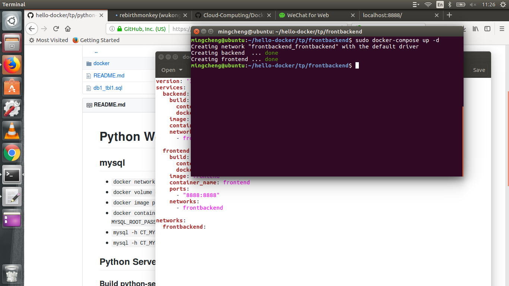

## Project 1
In this part, we use Docker-Compose to run `Frontend` and `Backend` in which `Frontend` is used to show the text we need to show and `Backend` is used to read the `input.txt` which can be changed by users. while initializing the image of frontend, it will start to listen the port of the backend with a js file. At backend side, a js file named `backend_servers.js` can read the text in `input.txt`. Finally, we can see this input at `localhost:8888`.
```
# This docker-compose file contains 3 parts: version, services and networks
version: '3'
services:
# Two services are used.  
  backend:
    build:
    # Build the image and container from the docker-file ./backend/Dockerfile
      context: ./backend
      dockerfile: Dockerfile
    image: backend # name the image
    container_name: backend # name the container
    networks:
    # Choose the network
      - frontbackend

  frontend:
    build:
    # Build the image and container from the docker-file ./frontend/Dockerfile
      context: ./frontend
      dockerfile: Dockerfile
    image: frontend # name the image
    container_name: frontend # name the container
    networks:
    # Choose the network
      - frontbackend
    ports:
    # Mapping the 8888 port of the container to the 8888 port of the host
      - "8888:8888"

networks:
  frontbackend:
```
### Result
1. Run docker-compose file to create two containers: `docker-compose up`

2. Verify the system by visiting the page: `localhost:8888`
3. Change the `input.txt` at the beckend and retest the system.

## Project 2

In this project, we use two containers. One is named as `mysql` which is use to read the database of mysql. The second is `python-server` which servers as the frontend. It gets the data from container `mysql` and puts on port 8888. For more details of the docker-compose file, please refer to the code and comments.

```
# This docker-compose file contains four parts: version, services, networks and volumes
version: '3'
services:
# Two services are used.  
  mysql:
    image: mysql:5.6 
	# Pull the sql image from the offical site, create the container based on this image.
    container_name: ct-mysql # define the container name
    networks:
	# Choose the network
      - net 
    volumes:
	# Attach the volume to container and specify the path of the volume in the container
      - vol_mysql:/var/lib/mysql
    environment:
	# Set the password
      - MYSQL_ROOT_PASSWORD=P@ssw0rd

  python-server:
    build: 
	# Build the image and container from the docker-file ./docker/Dockerfile
      context: ./docker
      dockerfile: Dockerfile
    image: img-python-server:0.1 # Set image name
    container_name: ct-python-server # Set container name
    networks:
      - net
    ports:
	# Mapping the 8888 port of the container to the 8888 port of the host
      - "8888:8888"
    environment:
	# Set the host of this container
      - MYSQL_HOST=ct-mysql
networks:
# Create a defaut network name as 'net'
  net:
volumes:
# Create a defaut volume name as 'net'
  vol_mysql:
```

### Result
1. Run docker-compose file to create two containers: `docker-compose up`
2. Initialize the database of mysql: `mysql -h CT_MYSQL_IP -u root -p < db1_tbl1.sql`
3. Verify the system: `curl localhost:8888`
